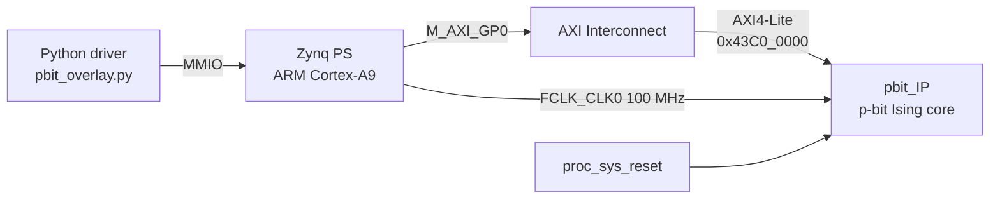

# p-bit Ising Engine on PYNQ-Z2

A hardware **probabilistic-bit (p-bit) Ising machine** implemented as a custom AXI4-Lite IP on the Zynq-7020 (PYNQ-Z2), controlled from Python through a PYNQ overlay. The demo maps a logic **AND gate** onto a 3-p-bit Ising network and runs it **forwards** (A, B → Y) and **backwards** (clamp Y, recover all consistent A, B), which is called *invertible logic*.

| | |
|---|---|
| **Board** | TUL PYNQ-Z2 (`xc7z020clg400-1`) |
| **Toolchain** | Vivado 2024.1, PYNQ |
| **Fabric clock** | 100 MHz (`FCLK_CLK0`) |
| **Interface** | AXI4-Lite slave, 32-bit data, base `0x43C0_0000` |
| **Arithmetic** | Q8.8 signed fixed point |
| **Network size** | N = 3 p-bits (AND gate) |

---

## 1. Why this project

Deterministic logic only runs one way: give it inputs and it computes outputs. A **p-bit** is a binary unit that fluctuates randomly between 0 and 1, and its bias toward one value is set by its input. If you couple p-bits with the right weights, the network spends most of its time in states that satisfy a logic relation. This gives two things a normal gate can't:

- **Invertibility:** fix the output and the network samples every input combination that could have produced it.
- **Sampling and optimization:** the same hardware can solve combinatorial problems (Max-Cut, SAT, factorization) when they are written as Ising energy functions. Lowering the "temperature" over time, called annealing, lets the network settle into low-energy solutions.

In physical hardware, p-bits can be built from stochastic magnetic tunnel junctions (MTJs). This project emulates p-bits digitally on an FPGA. That makes it a testbed for the algorithm, the fixed-point precision, and the hardware/software interface before moving to emerging devices.

I built it as a stepping stone for my undergraduate thesis on oscillator-based and probabilistic neuromorphic hardware: it let me test the p-bit update rule, fixed-point precision and the AXI interface on real hardware before moving to larger networks.

---

## 2. Theory

### 2.1 The p-bit equation

Each p-bit $m_i$ takes the value $-1$ or $+1$ and updates as

```math
I_i = \sum_j J_{ij} m_j + h_i
```

```math
m_i = \text{sgn}\left( \tanh(\beta I_i) - r \right), \qquad r \sim \mathcal{U}(-1, 1)
```

where $J_{ij}$ are the symmetric couplings, $h_i$ the biases, and $\beta$ the inverse temperature. With sequential updates, the network samples the Boltzmann distribution

```math
P(\mathbf{m}) \propto e^{-\beta E(\mathbf{m})}
```

```math
E(\mathbf{m}) = -\sum_{i \lt j} J_{ij} m_i m_j - \sum_i h_i m_i
```

In hardware, bit value `1` represents $m = +1$ and bit value `0` represents $m = -1$.

### 2.2 AND gate as an Ising network

With p-bit order A, B, Y (bit 0, bit 1, bit 2 of the `M` register):

```math
J = \begin{bmatrix} 0 & -1 & 2 \\ -1 & 0 & 2 \\ 2 & 2 & 0 \end{bmatrix}, \qquad
h = \begin{bmatrix} 1 \\ 1 \\ -2 \end{bmatrix}
```

All four valid truth-table rows share the same lowest energy, and every invalid row sits higher:

| A | B | Y | Valid AND row? | Energy E |
|---|---|---|---|---|
| 0 | 0 | 0 | ✅ | −3 |
| 0 | 1 | 0 | ✅ | −3 |
| 1 | 0 | 0 | ✅ | −3 |
| 1 | 1 | 1 | ✅ | −3 |
| 0 | 1 | 1 | ❌ | +1 |
| 1 | 0 | 1 | ❌ | +1 |
| 1 | 1 | 0 | ❌ | +1 |
| 0 | 0 | 1 | ❌ | +9 |

As $\beta$ grows, probability concentrates on the four valid rows. Clamping Y restricts sampling to the rows that agree with it, which is how the gate runs backwards.

### 2.3 Annealing

The driver ramps $\beta$ from 0.1 (hot, nearly random) to 3.0 (cold, near-deterministic) in 150 steps. This lets the network explore early and then settle into low-energy states instead of getting trapped.

---

## 3. System architecture



The block design (`mainDesign`) contains `processing_system7_0`, `ps7_0_axi_periph` (an AXI interconnect), `rst_ps7_0_100M`, and the custom `pbit_IP`.

### 3.1 Register map

| Offset | Name | Access | Description |
|---|---|---|---|
| `0x00` | `CTRL` | W | `[0]` enable, `[1]` soft reset |
| `0x04` | `BETA` | W | Inverse temperature β, Q8.8 signed |
| `0x08` | `SEED` | W | 32-bit PRNG seed (must be nonzero) |
| `0x0C` | `STATUS` | R | `[0]` sweep_done |
| `0x10` | `M` | R | Current p-bit states; bit *i* = p-bit *i* |
| `0x14` | `CNT` | R | Number of completed sweeps |
| `0x18` | `CLAMP_MASK` | W | `1` = hold p-bit *i* fixed |
| `0x1C` | `CLAMP_VAL` | W | Value to hold a clamped p-bit at |
| `0x40` | `J[0..N²−1]` | W | Couplings, row-major, Q8.8 signed |
| `0x40 + 4N²` | `H[0..N−1]` | W | Biases, Q8.8 signed |

### 3.2 Fixed point (Q8.8)

Weights, biases and β use 16-bit signed Q8.8 format: 8 integer bits and 8 fractional bits, so the resolution is 2⁻⁸ ≈ 0.0039 and the range is −128 to 127.996. The driver converts between floats and Q8.8 with `to_q88()` and `from_q88()`.

### 3.3 Inside the p-bit core

The random source is a 32-bit maximal-length Galois LFSR (taps 32, 22, 2, 1), seeded through the `SEED` register; a seed of zero would lock it, which is why `SEED` must be nonzero. Because every $m_j$ is ±1, the weighted input needs no multipliers: each term is simply $+J_{ij}$ or $-J_{ij}$. The `CNT` register counts completed sweeps so software can tell how many updates happened between two samples.

---

## 4. Repository structure

```
pbit-ising-pynq/
├── README.md
├── .gitattributes          # marks generated .tcl/.hwh so GitHub shows HDL as the main language
├── pynq_file/
│   ├── mainDesign.bit      # bitstream
│   ├── mainDesign.hwh      # hardware handoff (PYNQ reads IP names/addresses from it)
│   ├── mainDesign.tcl      # block design export (Vivado 2024.1)
│   └── pbit_overlay.py     # Python driver + AND-gate demo
└── rtl/                    # pbit_IP Verilog source and testbench
```

---

## 5. Running it on the board

1. Copy everything in `pynq_file/` to the PYNQ-Z2, e.g. `/home/xilinx/jupyter_notebooks/pbit/`. The `.bit` and `.hwh` files must sit together and share the same base name.
2. Run:

```bash
sudo python3 pbit_overlay.py
```

Or use it from a Jupyter notebook:

```python
import numpy as np
from pbit_overlay import PbitEngine

J = np.array([[0, -1, 2], [-1, 0, 2], [2, 2, 0]], float)
h = np.array([1, 1, -2], float)

eng = PbitEngine(N=3)
eng.load_gate(J, h, beta=2.0)

p = eng.histogram_annealed(np.linspace(0.1, 3.0, 150), n_samples=20000)
print(eng.invertible_and(1))   # clamp Y=1: should give A=B=1
print(eng.invertible_and(0))   # clamp Y=0: should give the other three (A,B) pairs
```

### Driver API

| Method | Purpose |
|---|---|
| `load_gate(J, h, beta, seed)` | Write couplings, biases, β and PRNG seed |
| `set_beta(beta)` | Change temperature during annealing |
| `reset()` / `enable(on)` | Soft reset and run control |
| `read_state()` | Read the current N-bit state |
| `clamp(mask, val)` | Hold selected p-bits at fixed values |
| `histogram_annealed(betas, n_samples)` | Anneal, then sample the state distribution |
| `anneal(betas)` | Anneal and return the final state |
| `invertible_and(y)` | Clamp Y and return the distribution over (A, B) |

---

## 6. Expected results

- **Free-running:** the four valid AND rows each appear about 25% of the time, and invalid rows are close to 0%.
- **Clamp Y = 1:** (A, B) = (1, 1) dominates.
- **Clamp Y = 0:** (0,0), (0,1) and (1,0) each appear about ⅓ of the time, and (1,1) is close to 0%.

---

## 7. Design procedure

1. **Algorithm model:** verify the AND-gate J, h and the p-bit update rule in Python/NumPy first.
2. **RTL design:** write the p-bit core (PRNG, activation, accumulator, update controller) in Verilog.
3. **Simulation:** testbench in Vivado (xsim) to check the state histogram against the software model.
4. **IP packaging:** wrap the core in an AXI4-Lite slave with Vivado's *Create and Package New IP* (`slv_reg0..31`) and map the registers.
5. **Block design:** Zynq PS + AXI interconnect + reset + `pbit_IP`, with a 100 MHz fabric clock and an auto-assigned address of `0x43C0_0000`.
6. **Implementation:** synthesis, place & route, then generate the bitstream; export the `.bit` and `.hwh`.
7. **Software:** write a PYNQ `MMIO` driver with Q8.8 conversion, clamping, annealing and histogram sampling.
8. **On-board test:** run forward and inverse AND, then compare against the expected distributions.

---

## 8. Bugs faced and fixes

### Bug 1: driver couldn't find the IP (`KeyError: 'pbitIP'`)
- **Symptom:** `PbitEngine()` crashed when it looked up the IP in `ol.ip_dict`.
- **Cause:** the driver defaulted to `ip="pbitIP"`, but the block-design instance (and so the key in the `.hwh`) is `pbit_IP`. PYNQ builds `ip_dict` from the instance names in the `.hwh`, not from the IP's package name.
- **Fix:** changed the default to `ip="pbit_IP"`.
- **Lesson:** read the names with `print(ol.ip_dict.keys())` instead of guessing them.

---

## 9. Limitations and future work

- **Network size is capped at N = 3.** The AXI-Lite address width is 7 bits, which gives 32 registers. J starts at register 16, so 16 + N² + N ≤ 32 allows at most N = 3. Larger networks need a wider address space, or moving J/h into BRAM.
- **Sampling is done in software.** `read_state()` is called through MMIO with `time.sleep()` delays, so samples are slow and can be correlated. An on-chip histogram counter or a DMA stream of states would give much faster, cleaner statistics.
- **Fixed annealing schedule from the CPU.** A hardware β-schedule generator would remove the Python loop from the critical path.
- **Next steps:** larger gates (full adder, multiplier for invertible factorization), sparse graph-coloured parallel updates, and Max-Cut benchmarks.

---

## 10. Tools

Verilog · Vivado 2024.1 (IP Integrator, IP Packager) · Zynq-7000 · PYNQ · Python / NumPy

## Author

**Jarif Shahriar Ahmed** ([@archnoid98](https://github.com/archnoid98)), EEE, Bangladesh University of Engineering and Technology (BUET)
